# Data Science in Production course


---

## Before you start
You can read the short and more **business oriented story** in this link:

https://github.com/brunokatekawa/RossmannSales

---

## Table of contents
- [Module 01. Understanding the business problem](#module-01-understanding-the-business-problem)

- [Module 02. Data description](#module-02-data-description)

- [Module 03. Feature Engineering](#module-03-feature-engineering)

- [Module 04. Exploratory Data Analysis (EDA)](#module-04-exploratory-data-analysis-eda)
  - [4.1 Univariate analysis](#41-univariate-analysis)
  - [4.2 Bivariate analysis](#42-bivariate-analysis)
  - [4.3 Multivariate analysis](#43-multivariate-analysis)

- [Module 05. Data Preparation](#module-05-data-preparation)
  - [5.1 Normalization](#51-normalization)
  - [5.2 Rescaling](#52-rescaling)
  - [5.3 Transformation](#53-transformation)

- [Module 06. Feature Selection](#module-06-feature-selection)

- [Module 07. Machine Learning Modeling](#module-07-machine-learning-modeling)

- [Module 08. Hyperparameter Fine Tuning](#module-08-hyperparameter-fine-tuning)

- [Module 09. Error translation and intepretation to business](#module-09-error-translation-and-intepretation-to-business)

- [Module 10. Deploying the model to production](#module-10-deploying-the-model-to-production)

- [Wrap up and lessons learned](#wrap-up-and-lessons-learned)

- [Next steps](#next-steps)

- [Final acknowledgments](#final-acknowledgments)

---

## Introduction
This is a book-like write up to register the progress of my journey through the course. But wait, what is the "Data Science in Production" course?

It's a course designed by [Meigarom Lopes](https://github.com/Meigarom), a Brazilian Data Scientist who is passionate about Data Science. For our luck, or at least mine, he designed this amazing course where he teaches Data Science and Machine Learning and how to deploy the model in the production environment. 

You can get more details about the course [here](https://sejaumdatascientist.com/como-ser-um-data-scientist/), which I recommend you to check it out.

So, after telling you all this, let's start.

<br>

---

## The dataset
In this course, we used the [Rossmann Store Sales](https://www.kaggle.com/c/rossmann-store-sales) dataset from Kaggle. I'll leave you to check the dataset.

<br>

---

## Module 01. Understanding the business problem
In this module, we get to learn how important is to first understand the business as a whole and to find the root cause of the problem that the stakeholders want us to solve.

**Key points:**
- Understand the context.
- Spot the root cause of the problem.
- Identify the project sponsor.
- Outline the solution's key points:
  - Granularity
  - The problem type
  - Elegible methods to solve the problem
  - How it'll be delivered

In addition, we get to learn **CRISP-DS (CRoss-Industry Process - Data Science)**, a very interesting and iterable approach for Data Science projects which enable us, in each iteration, to:
- Deliver an end-to-end version of the solution.
- Have a faster value delivery.
- Map all the possible problems thay we may find during the project development.

### Problem statement
This statement was defined after identifying the root cause of the problem and interviwed the stakeholders to understand the business as a whole. 

> *How might we identify the budget needed for renovations for each store?*

<br>

### Solution statement
This statement was defined after doing the Exploratory Data Analysis, since this phase gives us a clear business overview. 

> *We can use Time Series do predict the sales for each store in the next 42 days (six weeks).*

<br>

### Solution delivery 
The solution delivery was outlined in a cocreation workshop with the stakeholders.

>*The solution will be delivered as a Telegram bot who receives the store Id and repplies with the total amount of sales by the end of the next 6 weeks.*

[back to top](#table-of-contents)

<br>

---

## Module 02. Data description
In this module, we start getting familiar with the dataset to **understand how complex** is the problem that we are trying to solve.

**Key points:**
- Know the dataset size:
  - Do we have all the resources to start working on it?
  - Does our infrastructure support the volume of the information that we'll need to process?

- Variable types:
  - Which type os variables do we have in the dataset?
  - What is the percentage of each type?
    - Checking it helps us to choose the right techniques to manipulate the data.

- Missing values:
  - How many missing values do we have in the dataset?
  - Why there are missing values? (Issues: systems and/or manual input)
  - Depending on how critical is, we can decide whether not doing the project because there aren't enough data or use techniques to fill in the missing values.

- Summary statistics:
  - Get the **min, max, range, mean, median, standar deviation, skewness and kurtosis** values of the data for each numerical variable.
  
  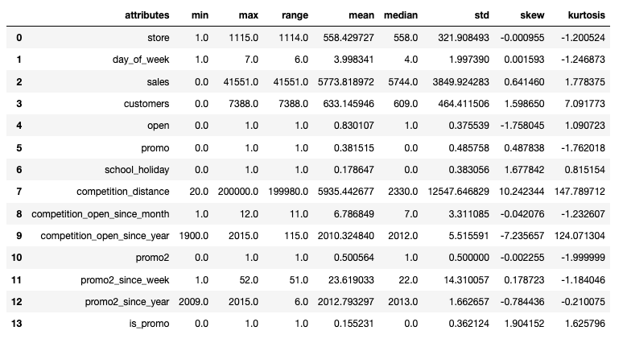
  
  - Plot box plot for categorical variables (`state_holiday`, `store_type` and `assortment` in relation to `sales`).
  
  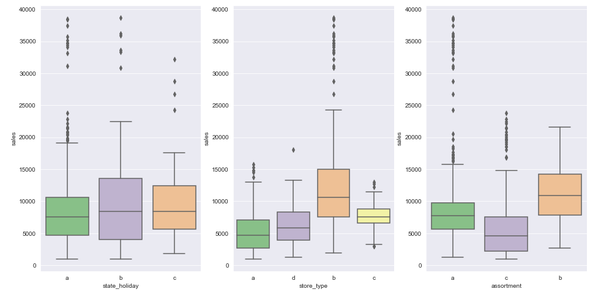

[back to top](#table-of-contents)

<br>

---

## Module 03. Feature Engineering
In this module, we learn how to create a mindmap that helps us to **decide which variables we need** in order to validate the hypotheses and do the feature engineering. This helps in the Exploratory Data Analysis (EDA) phase.

**Key points:**
- Identify the target:
  - What are we modeling? In this case, we are modeling the daily store sales.
  
- Identify the agents:
  - Who are the agents that act on the target? (e.g. customers, stores, employees, etc.)

- Identify the agents' attributes (e.g. customer has family, age, education, locale, etc.)

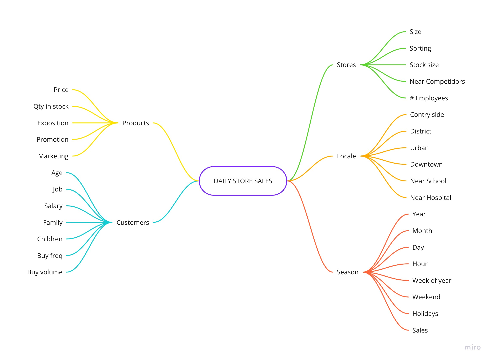

- Hypotheses list:
  - Outline all the hypotheses based on the mindmap and prioritize them.
  - We prioritize the hypothesis based on: whether we have or not the data at hand.
  - There may be data that we don't have it at hand and we need to spend some time on accessing it, collecting it, cleaning it and analyzing it.

- Variable filtering and variable selection:
  - Both need to be done before EDA.

  - **Variable filtering:** it is constrained to the Business. There are variables which values you will only be able to have when a business rule is triggered in the system. So, your model will not always be able to use them at hand to make predictions.

  - **Variable selection:** picking the most relevant variables for the model. Considers the correlations between variables. It does not take into account business rules.

[back to top](#table-of-contents)

<br>

---

## Module 04. Exploratory Data Analysis (EDA)
In this module, we get to learn a lot of awesome stuff about EDA. We start to identify how the explanatory variables impact the target variable (`sales`) and what is the power of this impact. Thus, by identifying this impact we can decide to choose the right variables for our model, so it can be more assertive.

**Key points**
- The 3 goals of EDA:
  - **Understand how the business works** and how it behaves through the data.
  - **Validate/Invalidate hypotheses** and provide new information to other people.
  - **Identify which explanatory variables** impacts the target variable.

- The 3 types of EDA:
  - **Univariate analysis.**
    - How is this variable?
    - Get summary statistics (min, max, distribution, range, etc.)

  - **Bivariate analysis.**
    - How the explanatory variable impacts the target variable?
    - Get correlation between them.
    - Validate / Invalidate hypotheses.

  - **Multivariate analysis.**
    - How is the relation between the explanatory variables?
    - Get correlation between them.

### 4.1 Univariate analysis
#### 4.1.1 Target variable (`sales`)
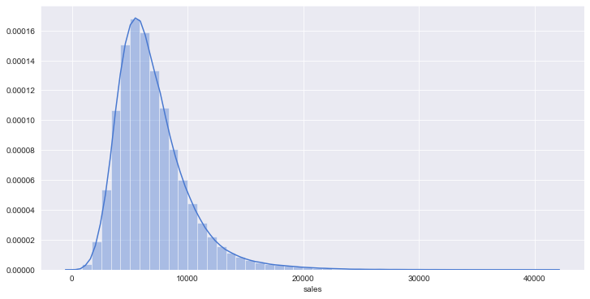

As we can observe, the distribution is **moderately skewed** (`skewness = 0.641460`) and presents a **positive kurtosis** (`1.778375`) which means that we have some possible outliers in our dataset. Thus, the distribution **does not follow a normal distribution**.

As the ML algorithms requires our data to have **independent variables and normal distribution**, we can apply some techniques to do the variable transformation.

#### 4.1.2 Numerical variables
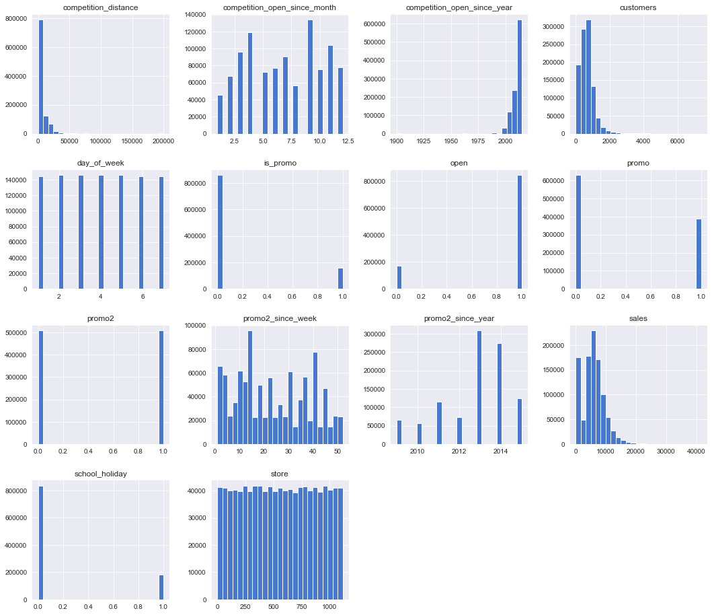

Analyzing the histograms, for:
- `competition_distance`: we have more competitors that are near the stores, as they gather in the range from 0 to near 50000. 

- `competition_open_since_month`: we have a somewhat seasonal opening of competitor stores.

- `day_of_week`: we have a distribution that is nearly uniform, this tells us that the sales nearly don't vary according to the day of the week. Thus, this variable, alone, doesn't have much relevance to the model.

- `is_promo`: we have higher sales when there is no promotion (`is_promo = 0`) than when we have (`is_promo = 1`).

- `competition_open_since_year`: we can clearly see that the opening of new competitors stores had a peak near 2015.

- `customers`: as this variable describes the number of customers in a given day, we have a high concentration at the beginning then an abrupt decrease on this number. This behavior might be due to the peaked increase on the opening of new competitors stores, as the customers start to be distributed among the stores.

- `day_of_week`: as the stores are open 7 days per week, we se that there is a distribution that is nearly uniform.

- `is_promo`: we can see that there are many more stores that weren't in promotion (`is_promo = 0`) than in promotion (`is_promo = 1`).

- `open`: we can see that there are many more stores that were open (`open = 1`) than closed (`open = 0`).

- `promo`: we can see that there are many more stores that weren't in regular promotion (`promo = 0`) than those who were (`promo = 1`).

- `promo2`: we can see that there were almost equally number of stores in consecutive promotion. This might have been an experiment from Rossmann to check whether being on a consecutive promotion would impact the number of sales.

- `promo2_since_week`: we can see there is no clear pattern, there are some peaks, but we'll need to dig deeper on this topic.

- `promo2_since_year`: we can see that there were many more stores in consecutive promotion around 2014.

- `sales`: we can see that there were many more sales ranging from $0 to nearly $10,000.

- `school_holiday`: we can see that there are many more stores that weren't affected by the closure of public schools (`school_holiday = 0`) than those who were (`school_holiday = 1`).

- `store`: as this variable describes the unique Id for each store, there is no real information that we can extract from this one.

#### 4.1.3 Categorical variable
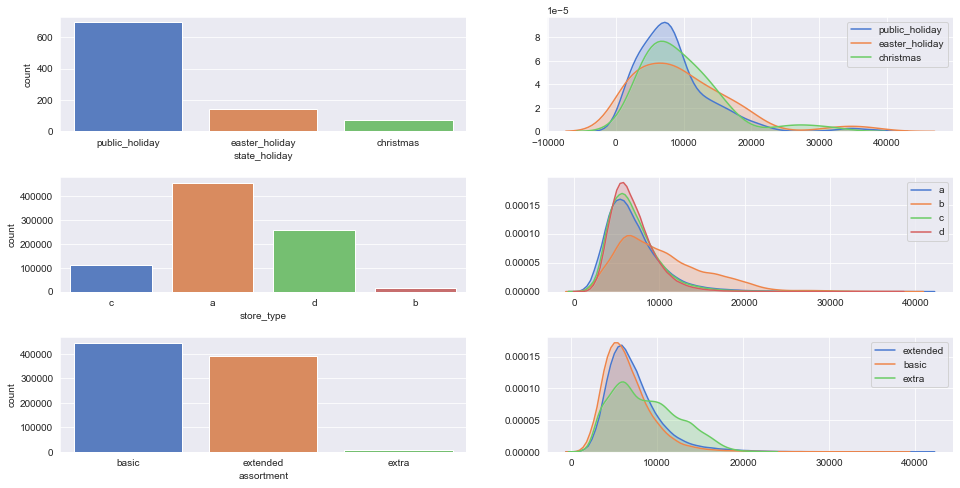

Analyzing the plots, we can see that:
- Although there are many more open stores on Easter holiday, the volume of sales is larger on Christmas. This might be due to Christmas promotion sales that stores have by the end of the year.

- For the stores of type `a`, `c` and `d` there is a high concentration of sales around $6,000. In addition, for the stores of type `b` the volume of sales is lower and its value range is much more distributed. As the provided dataset does not clearly describe the difference between the store types, it is not possible to knows whats could be generating these differences.

- For the assortment type `extended`, `basic` there is a high concentration of sales around $6,000. In addition, for the assortment `extra` the volume of sales is lower and its value range is much more distributed. This might be due the assortment of products each store have in stock and on sale which impacts the volume of sales.

[back to top](#table-of-contents)

<br>

### 4.2 Bivariate analysis
In this section, we validate / invalidate the hypotheses we outlined in Module 03.

#### H1. Stores with higher assortment should have higher sales.

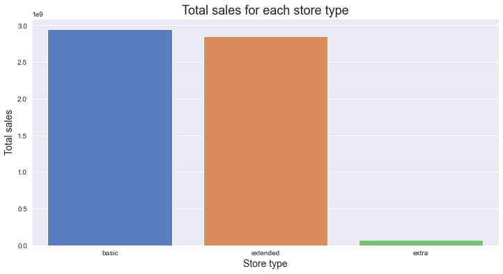

We are assuming that stores that have higher assortment are classified as type `extra`. Thus, observing the bar plot, we can verify that stores with **lesser assortment (`basic`) have higher sales**.

> #### In other words, **stores with higher assortment have lesser sales**.

However, we need to check if in the past, stores with higher assortment had higher sales.

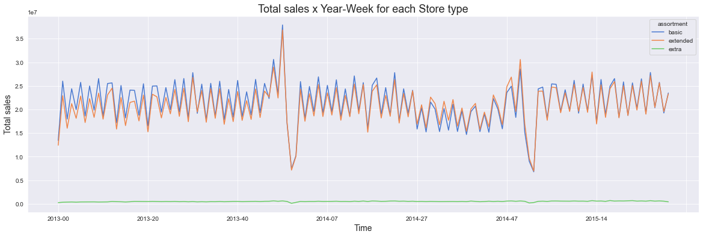

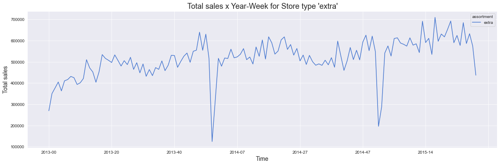

Observing the line plots, we can verify that **stores with higher assortment (`extra`) have lesses sales**. 

> #### So, our hypothesis is **FALSE**.

In addition, as the variables have distinct behavior, it may be interesting to **include them in our ML model**.

<br>

#### H2. Stores with nearer competitors should have lesser sales.

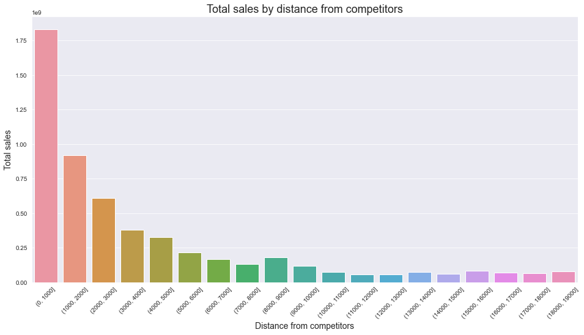

As we can observe from the bar plot, **stores with nearer competitors have higher sales**. 

> #### So, our hypothesis is **FALSE**.

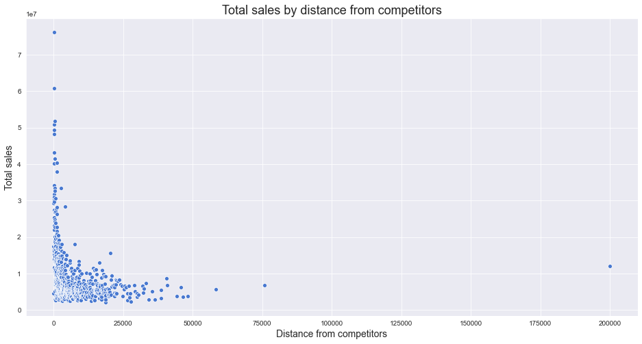

We can observe from the scatter plot that we have a higher concentration of sales as we decrease the competition distance, which also makes our hypothesis **FALSE**.

**Side-by-side plots**

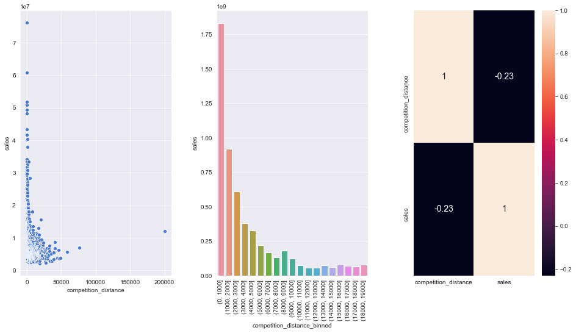

**Correlations**

As observed in the results, the Pearson's correlation coefficient between `competition_distance` and `sales` is `-0.23` which tells us that is a **weak negative correlation**. Despite the weakness, we may include the `competition_distance` because it has a somewhat influence on the target variable (`sales`).

<br>

#### H3. Stores with longer competitors should have higher sales.
We want to know how do our `sales` behave in relation to how long a competitor store has opened.

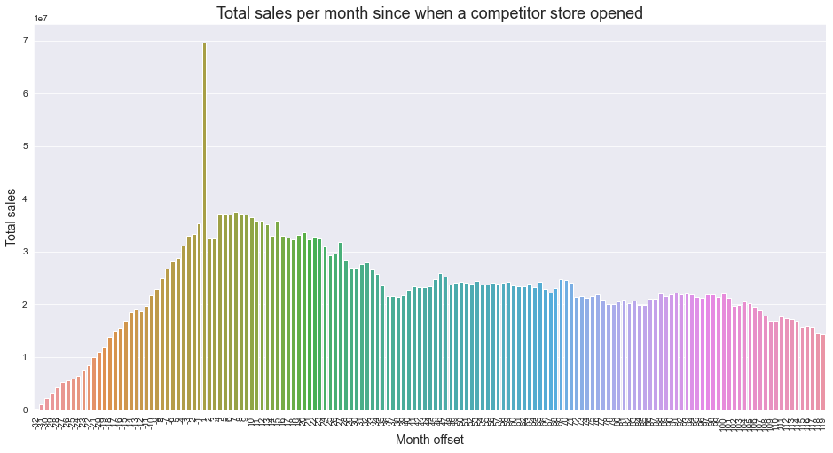

- **Negative offset values:** we already started selling and we know when a competitor store will still open in x months. 
- **Positive offset values:** competitor store has already opened and we started selling.

As values gets near zero the higher are the sales. **The earlier the competition is, the higher the sales are.** 

> #### Thus, our hypothesis is **FALSE**.

**Side-by-side plots**

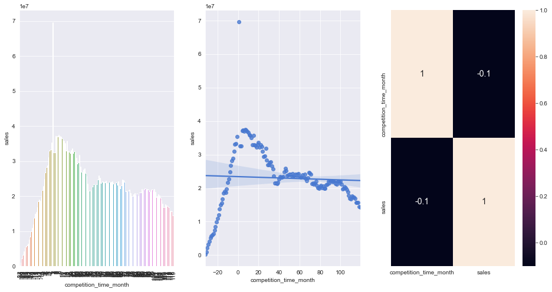

**Correlations**

As observed in the results, the Pearson's correlation coefficient between `competition_time_month` and `sales` is `-0.1` which tells us that is a **super weak negative correlation**. Despite the weakness, we may include the `competition_time_month` because it has a somewhat influence on the target variable (`sales`). We'll check its relevance later in our project.

<br>

#### H4. Stores with longer period of time in promotion should have higher sales.
As there is a lot of data, I divided the dataset in two periods: regular promotion and extended promotion.

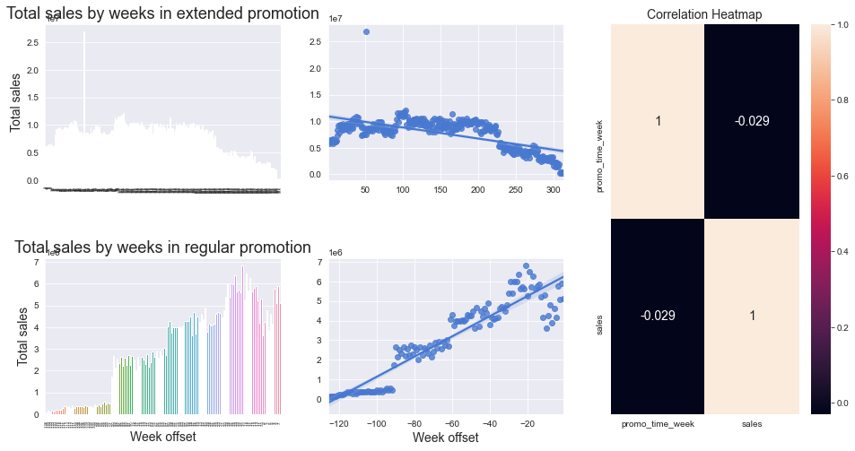

As we can observe in the **Total sales x Weeks in extended promotion**, there's a period in which the extended promotion results in more sales, then after a period of time, the total sales starts to decrease.

From the **Total sales x Weeks in regular promotion**, we can observe that as the offset gets more and more near zero, the sales starts to increase.

Thus, **stores with longer period of time in promotion don't have higher sales.**, because the sales start to decrease as the promotion gets longer. 

> #### Thus, our hypothesis is **FALSE**.

**Correlations**

In addition, from the **Correlation Heatmap** we got a coefficient of `-0.029` which is pretty close to `zero`. Thus, we have a **super weak correlation**, which makes sense because looking at our data, we have long periods of almost constant total sales (see  **Total sales x Weeks in extended promotion**).

So, maybe we won't include `promo_time_week` in the model. Of course, this variable might work if we combine it with another variable, but we'll leave it for the time being.

<br>

#### H5. Stores with longer period of time in promotion should have higher sales.
As this hypothesis is similar to H4. We'll leave to validate it in the next **CRISP cycle**.

<br>

#### H6. Stores with higher consecutive promotions should have higher sales.

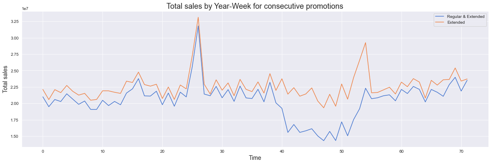

Observing the results it seems that **stores with higher consecutive promotions don't have higher sales**. 

> #### Thus, our hypothesis is **FALSE**.

**Relevance**

Thinking about the relevance of the variable `promo2` to the ML model, we can say that its relevance is low. Despite the particular decrease in sales during a period, we still need a second opinion that will come from an algorithm that will aid us to decide whether we include `promo2` or not.

<br>

#### H7. Stores that open on Xmas should have higher sales.


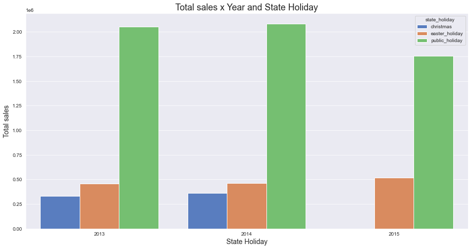

As observed in the previous results, **stores that open on Xmas don't have higher sales**. 

> #### Thus, our hypothesis is **FALSE**.

One observation that we need to make here is that on year 2015, we still don't have the data from Xmas sales, because the data ends on July 31st, 2015.

In addition, as we have changes in `sales` depending on the type of `state_holiday` and which `year` is, we can consider these variables in our ML model.

<br>

#### H8. Stores should have higher sales along the years.

**Side-by-side plots**

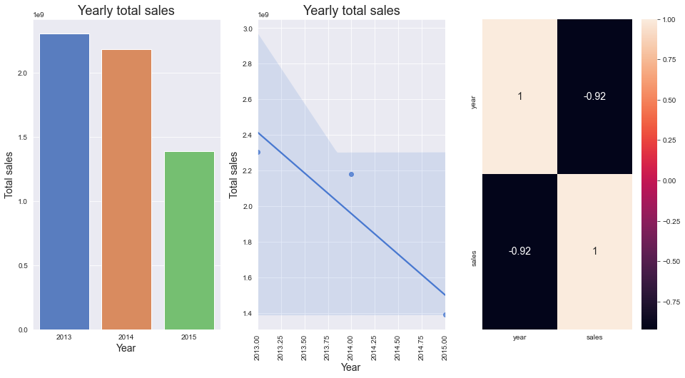

As observed in the previous results, stores **don't have higher sales along the years**. In addition, by observing the Pearson correlation coefficient of `-0.92`, we can verify that there is a **strong negative correlation** between `year` and `sales`. Thus, our hypothesis is **FALSE**.

<br>

#### H9. Stores should have higher sales on the second semester of the year.

**Side-by-side plots**

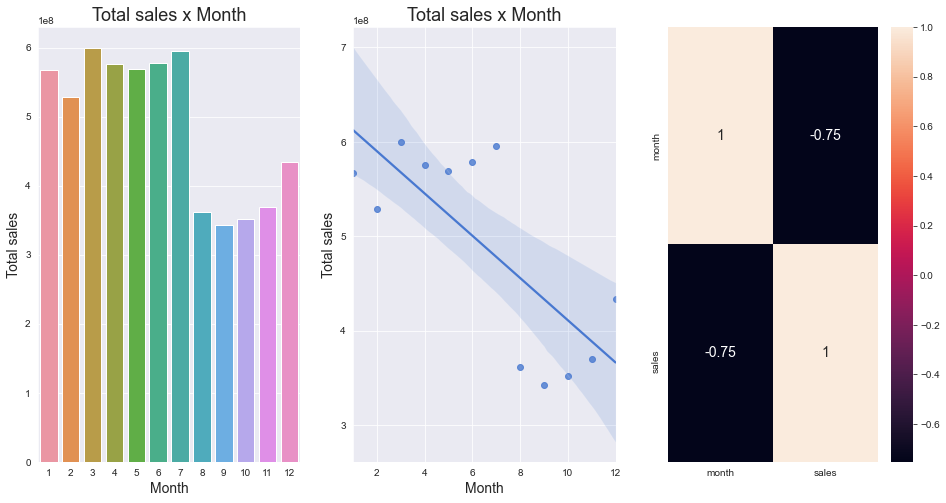

As observed in the previous results, stores **don't have higher sales on the second semester of the year**. In addition, by observing the Pearson correlation coefficient of `-0.75`, we can verify that there is a **strong negative correlation** between `month` and `sales`. 

> #### Thus, our hypothesis is **FALSE**.

<br>

#### H10. Stores should have higher sales after the 10th day of the month.

**Side-by-side plots**

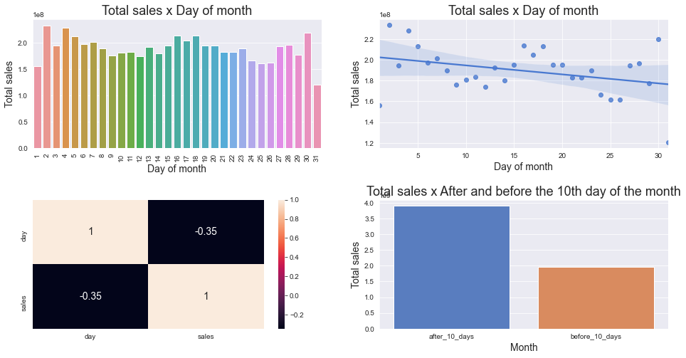

As observed in the previous results, stores **have higher sales after the 10th day of the month**. 

> #### Thus, our hypothesis is **TRUE**.

**Correlation**

In addition, checking the Pearson's correlation coefficient, we got a value of `-0.35` which tells us that is a **no so strong correlation** between `day` and `sales`. However, as we have different values for total sales before and after the 10th day of the month, this variable **can be relevant for our ML Model**.

<br>

#### H11. Stores should have lesser sales on weekends.

**Side-by-side plots**

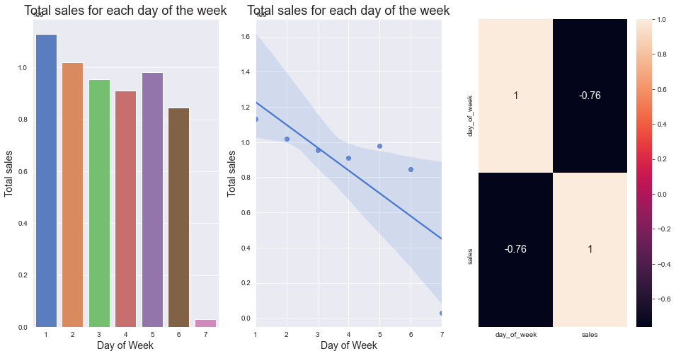

**Correlation**

As observed in the previous results, stores **have lesser sales on weekends**. In addition, by observing the Pearson correlation coefficient of `-0.75`, we can verify that there is a **strong negative correlation** between `day_of_week` and `sales`. 

> #### Thus, our hypothesis is **TRUE**.

<br>

#### H12. Stores should have lesser sales during school holidays.

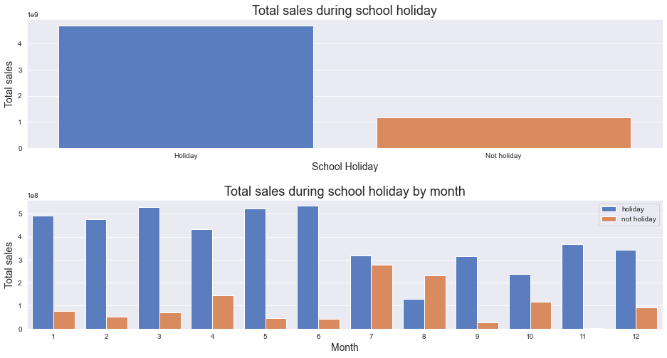

As observed in the previous results, in general, stores **have lesser sales during school holidays, except on months of July and August**. 

> #### Thus, our hypothesis is **TRUE**.

#### 4.2.1. Hypotheses summary
| Hypothesis | Conclusion | Relavance to ML model |
| --------------- | --------------- | --------------- |
| H1 | False | Low |
| H2 | False | Medium |
| H3 | False | Medium |
| H4 | False | Low |
| H5 | (later analysis) | (later analysis) |
| H6 | False | Low |
| H7 | False | Medium |
| H8 | False | High |
| H9 | False | High |
| H10 | True | High |
| H11 | True | High |
| H12 | True | Low |

[back to top](#table-of-contents)

<br>

### 4.3 Multivariate analysis
In this section we'll check the correlations between the explanatory variables, separating the analysis for **numerical attributes** and **categorical attributes**.

#### 4.3.1 Numerical Attributes

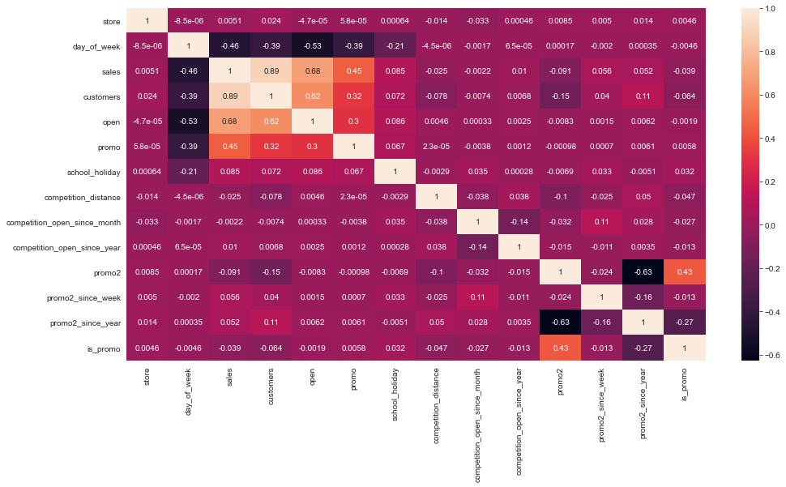

As observed in the matrix:

| Variable A | Variable B | Correlation |
| --------------- | --------------- | --------------- |
| `day_of_week` | `open` | Medium |
| `day_of_week` | `sales` | Medium |
| `day_of_week` | `promo` | Weak |
| `day_of_week` | `school_holiday` | Weak |
| `open` | `promo` | Weak |
| `open` | `customer` | Strong |


#### 4.3.2 Categorical Attributes

To make the correlation between two categorical variables, we'll use the [Cramér V method](https://en.wikipedia.org/wiki/Cram%C3%A9r%27s_V).

Please, refer to the notebook to check the calculations.

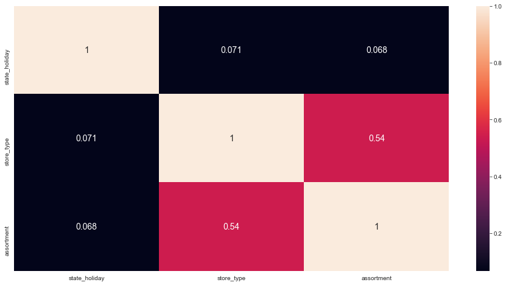

As observed in the results, the correlation coefficient between `store_type` and `assortment` is `0.54` which is a medium correlation and makes sense, as the bigger the store, the higher is the assortment of its products.

[back to top](#table-of-contents)

<br>

---

## Module 05. Data Preparation
In this module, we get to learn how to make data preparation to model our data for the ML training, as the most ML algorithms takes advantages of **numerical data**.

**Key points:**

- There are 3 types of data preparation:
  1. **Normalization:** rescales the center to 0 with standard deviation equal to 1.  It is usually applied to data that is Normally distributed.

  2. **Rescaling:** rescales the data to the interval from 0 to 1. It is usually applied to data that are non-Normally distributed. We can use two techniques for this type.
      
      - **Min-Max Scaler:** uses the data range.
      - **Robust Scaler:** uses the data IQR.

  3. **Transformation:** transforms the data through encoding, magnitude or nature.
      - **Encoding:** we need to identify which values does a categorical value has. Much of this work was done at EDA phase. In addition, there are several types os encoding, such as: One Hot Encoding, Label Encoding, Ordinal Encoding, Target Encoding, Frequency Encoding, Embedding Encoding.

      - **Magnitude:** the purpose is to bring the data distribution as closer as possible to a Normal distribution. We can apply some techniques, such as: Logarithm, Box-Cox, Cube-Root, Square-Root, Sine and Cosine.

      - **Nature:** the purpose of it is to bring the number nature of a set of data. It works well with cyclic variables (e.g months, days of week, week of year, etc).

For more info about **Scale, Standardize or Normalize with scikit-learn**, please, check this awesome article: https://www.kaggle.com/discdiver/guide-to-scaling-and-standardizing

<br>

### 5.1 Normalization
We need to check the variables distributions. So, we check the distributions from section **4.1.2 Numerical variable**.


As we can observe, there is no variable presenting a normal distribution, note even nearly normal. So, it is preferred to leave as it is than to risk a erroneous normalization.


[back to top](#table-of-contents)

<br>

### 5.2 Rescaling
#### 5.2.1 Rescaling `competition_distance`

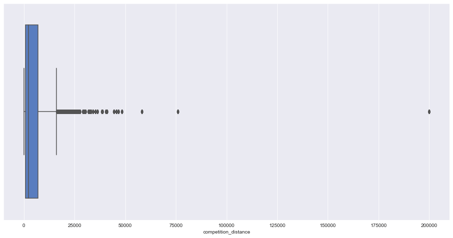

As observed in the results, there is a clear presence of outliers.

**Data after rescaling**

Here, I used the [sklearn.preprocessing.RobustScaler](https://scikit-learn.org/stable/modules/generated/sklearn.preprocessing.RobustScaler.html?highlight=robustscaler#sklearn.preprocessing.RobustScaler) because of the presence of strong outliers.

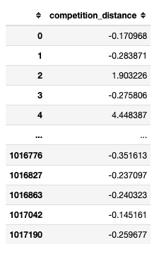

<br>

#### 5.2.2 Rescaling `competition_time_month`

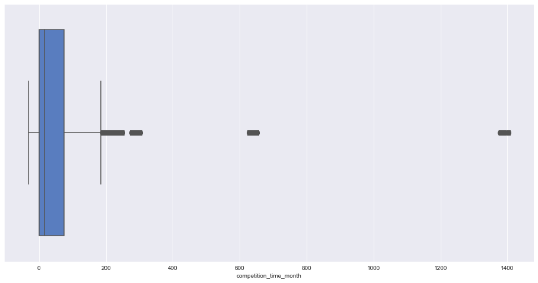

As observed in the results, there is a clear presence of outliers.

**Data after rescaling**

Here, I used the [sklearn.preprocessing.RobustScaler](https://scikit-learn.org/stable/modules/generated/sklearn.preprocessing.RobustScaler.html?highlight=robustscaler#sklearn.preprocessing.RobustScaler) because of the presence of strong outliers.

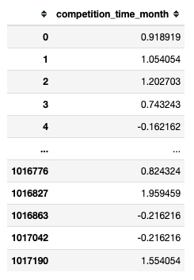

<br>

#### 5.2.3 Rescaling `promo_time_week`

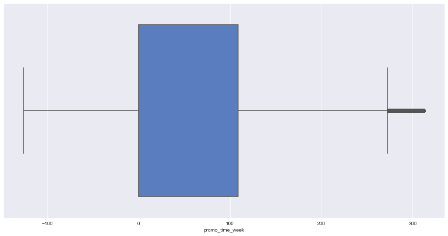

As observed in the results, there is a clear presence of outliers.

**Data after rescaling**

Here, I used the [sklearn.preprocessing.MinMaxScaler](https://scikit-learn.org/stable/modules/generated/sklearn.preprocessing.MinMaxScaler.html?highlight=sklearn%20preprocessing%20minmaxscaler) despite the presence of outliers, they are not that far from the superior whisker. So we can take a chance to use the Min-Max Scaler.

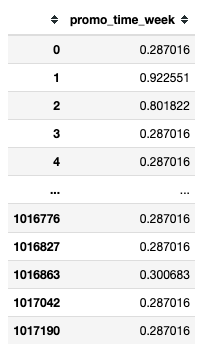


[back to top](#table-of-contents)

<br>

### 5.3 Transformation
#### 5.3.1 Encoding
##### 5.3.1.1 One Hot Encoding for `state_holiday`

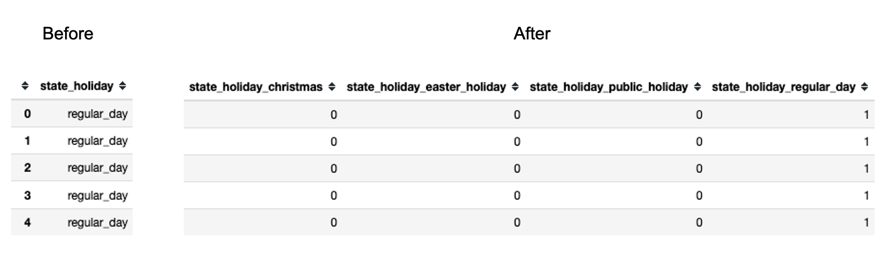


##### 5.3.1.2 Label Encoding for `store_type`

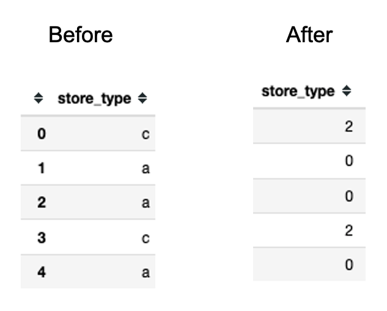


##### 5.3.1.3 Label Encoding for `assortment`

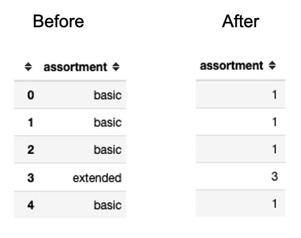


#### 5.3.2 Target Variable Transformation
In this section, I applied the logarithm transformation to the `sales` target variable.

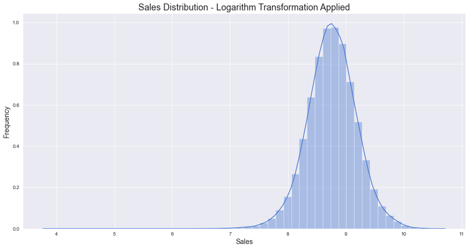


#### 5.3.3 Nature Transformation

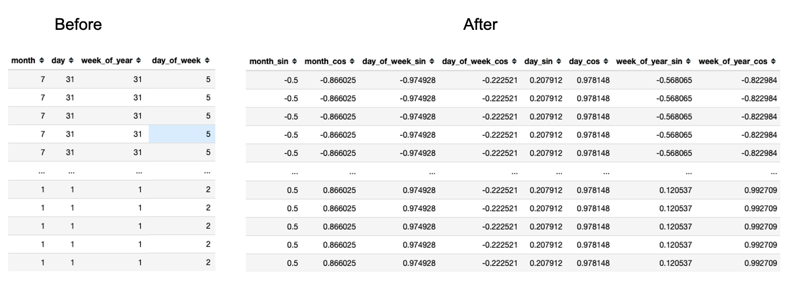


[back to top](#table-of-contents)

<br>

---

## Module 06. Feature selection
In this module, we get to learn why doing feature selection is important and how to select the most relevant features for ou ML model through the usage of algorithms.

As follows on **Occam's Razor:**

> "*Entities should not be multiplied without necessity.*"
> "*Plurality is not to be posited without necessity*"

It is variously paraphrased by statements like "the simplest solution is most likely the right one".

If you want to know more about it check:
https://en.wikipedia.org/wiki/Occam%27s_razor


**Key points:**

- Keep it simple.
- Remove collinearity.
- There are basically 3 methods for feature selection:
  1. **Filter Methods:** takes advantage of the correlation between variables and its types (numerical and categorical).

  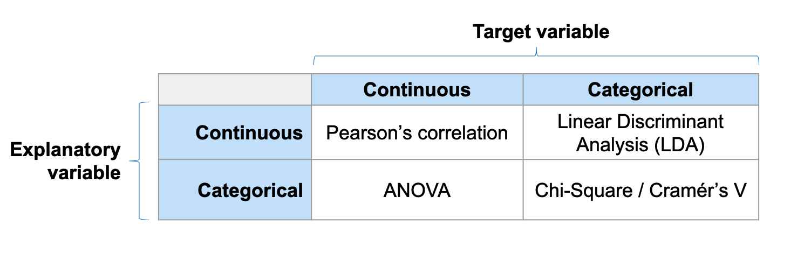

  2. **Embedded Methods:** takes advantage of algorithms, such as: Random Forest, Lasso Regression and Ridge Regression.
  
  3. **Wrapper Methods:** it's a process and we can make use of Boruta's algorithm.

In this project, we used the **Wrapper Method** because we wanted to see Boruta's algorithm in action and it's a good method to confront later with our hypotheses.

By running Boruta for our dataset, the algorithm considers the following features as relevant:

```python
['store', 
'promo', 
'store_type', 
'assortment',
'competition_distance', 
'competition_open_since_month',
'competition_open_since_year',
'promo2', 
'promo2_since_week',
'promo2_since_year',
'competition_time_month', 
'promo_time_week',
'day_of_week_sin',
'day_of_week_cos',
'month_cos',
'day_sin',
'day_cos', 
'week_of_year_cos']
```
Comparing the columns between the ones that we outlined in the conclusion from our hypothesis and the ones that Boruta suggested, we can see some differences.

However, this is not a problem, **since we are working in an iterative process (CRISP-DS)**. We can first test the model using only the features that Boruta suggested, then include the one by one from our hypothesis and test to see what happens.

We'll include: `month_sin`, `week_of_year_sin`. In addition, we had dropped `date` and `sales` because the first will be inevitably used by the ML model as we are going to predict the later, so we have to include them back too.

So, the final set of selected features are:

```python
['store',
 'promo',
 'store_type',
 'assortment',
 'competition_distance',
 'competition_open_since_month',
 'competition_open_since_year',
 'promo2',
 'promo2_since_week',
 'promo2_since_year',
 'competition_time_month',
 'promo_time_week',
 'day_of_week_sin',
 'day_of_week_cos',
 'month_sin',
 'month_cos',
 'day_sin',
 'day_cos',
 'week_of_year_sin',
 'week_of_year_cos',
 'date',
 'sales']
```

[back to top](#table-of-contents)

<br>

---

## Module 07. Machine Learning Modeling
In this module, we get to learn the different types of Machine Learning (**Supervised, Unsupervised and Semi-Supervised**), why and when to apply each one. In addition, we apply different supervised learning models (**Average, Linear Regression, Lasso Regression, Random Forest Regression and XGBoost Regression**) to compare their performances and apply **Cross validation** to help us decide which model we're going to use for our predictions.

**Key points:**

- Set the Average model as your baseline.

-  Start by the simplest models which are Linear Regression and Lasso Regression.

- Then, go for the next level of complexity: Random Forest and XGBoost.

- Avoid overfitting by applying Cross Validation training and tests.

<br>

### 7.1 Comparing models' performance
In this first comparison, before Cross Validation, we divided our dataset in two: training and test datasets.

- For **training**, we separated all the records before the last 6 weeks of the dataset. 
- For **test**, the records from the last 6 weeks of the dataset.

These were the results:

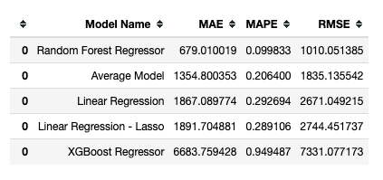

 As observed in the results, the **Random Forest Regressor** had the least RMSE (`1010.322344`). However, this doesn't mean that the Random Forest is the final model that we're going to pick for our predictions, because we need to make **cross validation tests** for each model to check their behavior in different data and then pick the right model.

<br>

### 7.2 Cross validation and comparing models' performance
As the model we're developing is a Time Series model, we need to divide our dataset respecting the time. So for each iteration (`KFold`) of the cross validation, we're getting a different parts of ou dataset based on the records dates.


These were the results:

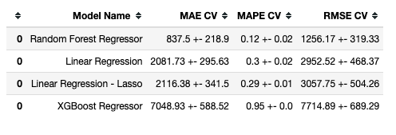

 As observed in the results, the Random Forest Regressor had the least RMSE (`1256.17 +- 319.33`). However, in this project, we're going to go with fine tuning the **XGBoost Regressor** to check the results.

[back to top](#table-of-contents)

<br>

---

## Module 08. Hyperparameter Fine Tuning 
In this module, we get to learn what is hyperparameter fine tuning, why do it and three strategies for doing this (**Random Search, Grid Search and Bayesian Search**). The main purpose of doing this is to find the values of each parameter that maximizes the model's performance.

**Key points:**

- It's not recommended to spend too long on this step, since the fine tuning might improve just a little bit the model's performance. However, it's always a good idea to balance this improvement to the impact that will cause on the business.

<br>

### 8.1 Advantages and disadvantages of each strategy

| Strategy | Advantage | Disadvantage |
| --------------- | --------------- | --------------- |
| Random Search | Easy to implement and has low cost | You may never be able to find the best set of values that maximizes model's performance. |
| Grid Search | It finds the right values (or something very near).   | It might takes forever to calculate and has high cost. |
| Bayesian Search | Defines the values for the hyperparameters based on past learning. | High complexity to learn how to implement it. |

<br>

### 8.2 The results
In this project, as I mentioned earlier, we did the fine tuning for the **XGBoost Regressor**. In addition, I also mentioned that the fine tuning might improve the model's performance by just a little bit. However, we've applied the **Random Search** strategy and got some very interesting results.

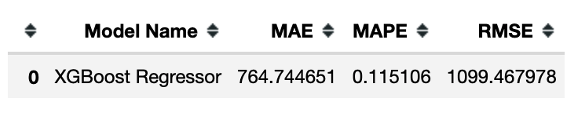

As we can see, the there was a great improvement compared to the previous results. 

|  | Before Fine Tuning | After Fine Tuning |
| --------------- | --------------- | --------------- |
| MAE | `6683.759428` | `764.744651` |
| MAPE | `0.949487` | `0.115106` |
| RMSE | `7331.077173` | `1099.467978` |

[back to top](#table-of-contents)

<br>

---

## Module 09. Error translation and intepretation to business
In this module, we get to learn how to translate the MAE and MAPE to business language.

**Key points:**

- We need to understand the model's performance in order to be able to tell the C-Level how much money this model will bring to the company.

- Although, the first version of our model will be deployed to production, we need to report to the business that there are stores that are more difficult to make the predictions. Thus, some strategies that may solve this challenge in the next CRISP iteration could be taking a closer look on the variables, try other methods and other techniques in order to improve the predictions. As we can see below:

  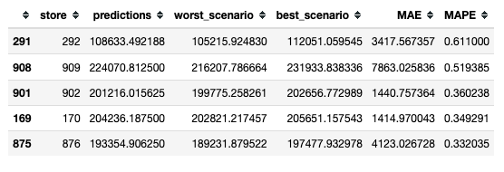

  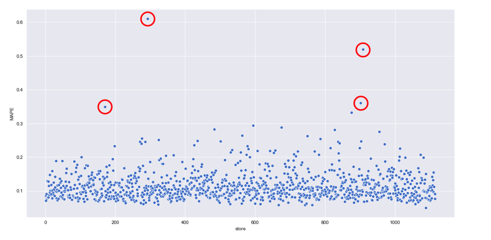
  
  **MAPE x error:** the points circled in red are examples of challenging sotres.

<br>

### 9.1 Characteristics of each error metric

- **MAE:**
  - Assigns equal weight to all errors.
  - Robust in the presence of outliers, that is, invariable to outliers.
  - Easy understanding by the business team.

- **MAPE:**
  - Shows how far the prediction is from the actual value, on average, as a percentage.
  - Widely used to report the results.
  - It cannot be used if the response variable contains zero. If you have to predict zero, then you have to use other metrics.

- **RMSE:**
  - It gives a lot of weight to large errors.
  - Sensitive in the presence of outliers.
  - Ideal for measuring the machine learning model's performance.

<br>

### 9.2 Machine Learning Performance

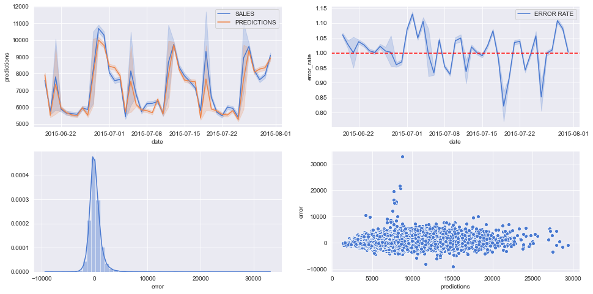

Observing the results, we can see that:
- By observing the **first and second line plots**, we can see that the predictions or our model is pretty close to the real value for `sales`. On the other hand, the error rate has some variance.

- By observing the **histogram**, the error distribution almost follows a normal distribution. 

- By observing the **scatterplot** for the errors, the points seems well fit in a horizontal tube which means that there's a few variation in the error. If the points formed any other shape (e.g opening/closing cone or an arch), this would mean that the errors follows a trend and we would need to review our model.

[back to top](#table-of-contents)

<br>

---

## Module 10. Deploying the model to production
In this module, we get to learn how to deploy our machine learning model to production environment in order to **make it accessible to any person with a smartphone with Telegram app installed**.

### 10.1 The cloud platform
For this project, we used [Heroku](https://www.heroku.com) to deploy our model.

<br>

### 10.1 Creating a bot in Telegram
First, to create our bot, we need to talk to a... bot! Yes, the [**BotFather**](https://telegram.me/BotFather) who is responsible for assisting us in the creation of a bot for Telegram. I won't describe the process in details here because the documentation from Telegram is pretty complete and easy to follow.

Here is the documentation link: https://core.telegram.org/bots#3-how-do-i-create-a-bot

<br>

### 10.2 Telegram bot architecture

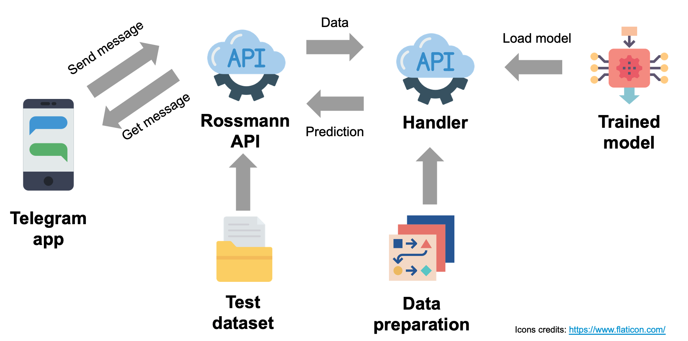

As pictured, the user sends a message to the bot containing the `store_id` which sends it to the **Rossmann API** which parses the message to extract the `store_id` and loads the **Test dataset**, then it calls a method from the Handler API sending the data. The **Handler API** makes all the operations on the data (cleaning, feature engineering, data preparation, modelo loading and prediction), then it returns the prediction to the Rossmann API which gets the returned data from the Handler API, formats it in a comprehensivable message to be sent to the user.

To get more info about the **Telegram's bot API**, please visit https://core.telegram.org/bots/api

<br>

### 10.3 Prediction in action
As the commands in Telegram bot starts with '`/`', we need to include it in the message sent to the bot. Example: "`/42`" (which is telling the bot to send us the predictions for the store whose `store_id` is `42`). 


[back to top](#table-of-contents)

<br>

---

## Wrap up and lessons learned
The key takeaways from this course were:

- The **CRISP** approach to Data Science projects helps you keep track of each step of the project. In addition, it makes the Data Science **process easy to understand and transparent to all the stakeholders**.

- The **business understanding** is really crucial to the success of the project, because it enables the team to focus on solving the root cause of the problem. It may take longer to start having our hands dirty on the data, but **it really pays off**.

- The **EDA** should not be neglected, since it's the core of our analysis and helps us choose **the right features** to include in our ML model. In addition, it gives us the power to accept and/or reject hypotheses and question the *status quo*.

- When Machine Learning modeling, **always start simple**. Don't try to be too fancy, otherwise, you'll get lost in unnecessary complexity that could be avoided and saving a lot of time which, by the end of the day, it translates into **saving money**.

- **Have something tangible** to show your client the results of all the effort you team went through in order to solve the business problem. In this project, we did it by making a Telegram Bot.

[back to top](#table-of-contents)

<br>

---

## Next steps

- Experiment with other Machine Learning algorithms to improve business performance.

- Experiment with selecting other features to see how much the RMSE is impacted.

- Experiment with other hyperparameter fine tuning strategies to see how much the RMSE is impacted.

<br>

---

## Final acknowledgments

I want to give special thanks to **Meigarom** who supported me as a true mentor and a friend. He is an amazing person who is always willing to help people. I look forward to have more courses designed by him. If you want to know more about Meigarom, check hist [YouTube](https://www.youtube.com/channel/UCar5Cr-pVz08GY_6I3RX9bA) channel and [LinkedIn](https://www.linkedin.com/in/meigarom/).

It was a really amazing arc in the journey for Data Science. I'm glad that I decided to document this project to share with you all.

I also want to thank you, reader, who invested your time to read through this project report.

Also, be sure to connect with [me on LinkedIn](https://www.linkedin.com/in/brunokatekawa/). Let's share our knowledge and learn with each other!

[back to top](#table-of-contents)